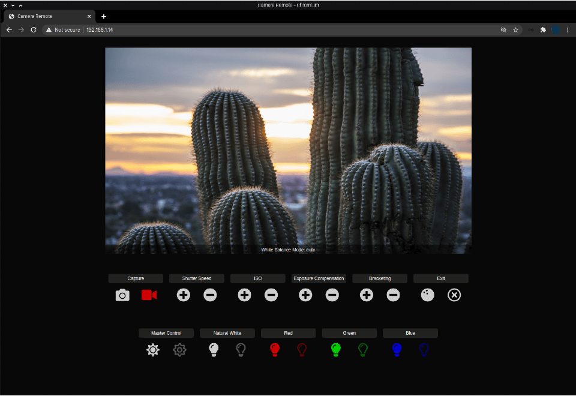

# Camera Remote

Combining this program with a Raspberry Pi HQ camera, a Raspberry Pi Zero WH, and an Adafruit 16-LED NeoPixel ring will result in a camera that can be controlled via a web page.

:information_source: &nbsp; *The primary intended use of this application is for still photography and photogammetry.  Preview is suspended during video capture due to apparent hardware limitations.   This system can be used to capture video, but it currently is not user-friendly.*

---
## Use With Other Camera Software

**Optionally**, this application may be used in conjunction with one of the following applications:
   - [Camera Zero](https://github.com/eat-sleep-code/camera.zero): Camera Remote can be triggered by long-pressing the pale orange button for 5 - 9 seconds.  You can switch back to trackball control from within Camera Remote.


---
## Getting Started

- Use [raspi-config](https://www.raspberrypi.org/documentation/configuration/raspi-config.md) to:
  - Set the Memory Split value to a value of at least 192MB
  - Enable the CSI camera interface
  - Set up your WiFi connection
- Connect the Raspberry Pi HQ Camera to your Raspberry Pi


## Installation

Installation of the program, any software prerequisites, as well as DNG support can be completed with the following two-line install script.

```
wget -q https://raw.githubusercontent.com/eat-sleep-code/camera.remote/main/install-camera.sh -O ~/install-camera.sh
sudo chmod +x ~/install-camera.sh && ~/install-camera.sh
```

---

## Usage
```
camera.remote
```

### Web Controls



The following attributes can be adjusted from the web interface:

1) Capture
     - Still Photo
     - Video*
1) Shutter Speed
1) ISO
1) Exposure Compensation
1) Bracketing
1) Toggle trackball control (if equipped)
1) Scene Lighting - *currently limited to control of a 16-LED NeoPixel array*
     - All Lights (on/off)
     - Natural White (256 steps)
     - Red (256 steps)
     - Green (256 steps)
     - Blue (256 steps)

---

## Infrared Cameras
If you are using an infrared (IR) camera, you will need to modify the Auto White Balance (AWB) mode at boot time.

This can be achieved by executing `sudo nano /boot/config.txt` and adding the following lines.

```
# Camera Settings 
awb_auto_is_greyworld=1
```

Also note, that while IR cameras utilize "invisible" (outside the spectrum of the human eye) light, they can not magically see in the dark.   You will need to illuminate night scenes with one or more [IR emitting LEDs](https://www.adafruit.com/product/387) to take advantage of an Infrared Camera.

---

:information_source:  &nbsp; *This application was developed using a Raspberry Pi HQ (2020) camera and Raspberry Pi Zero WH and Raspberry Pi 4B boards.   Issues may arise if you are using either third party or older hardware.*
